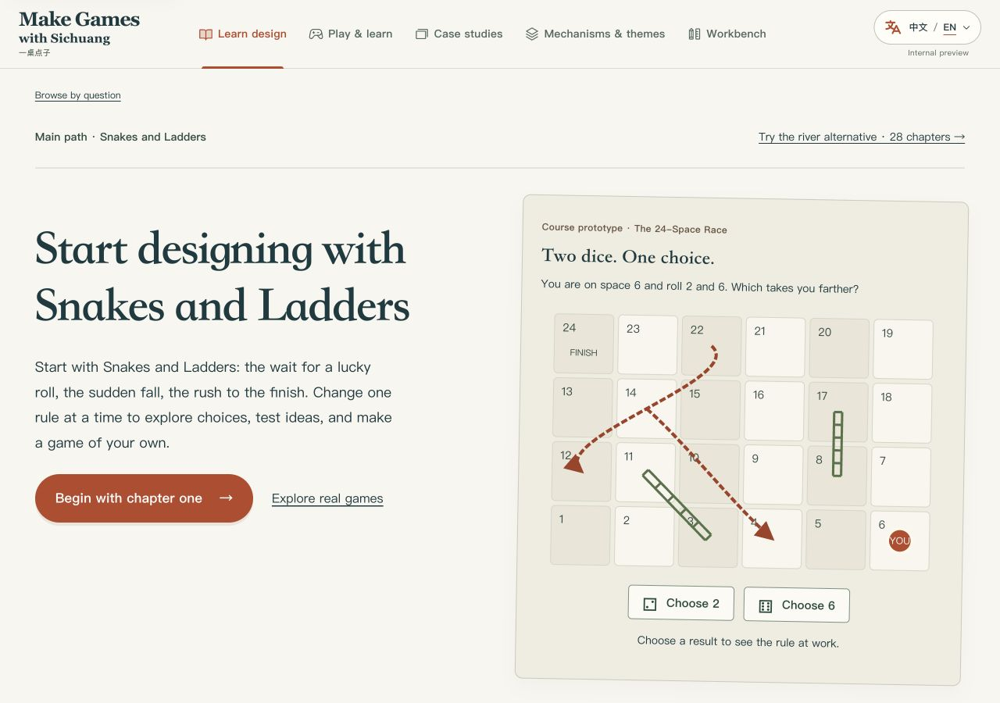
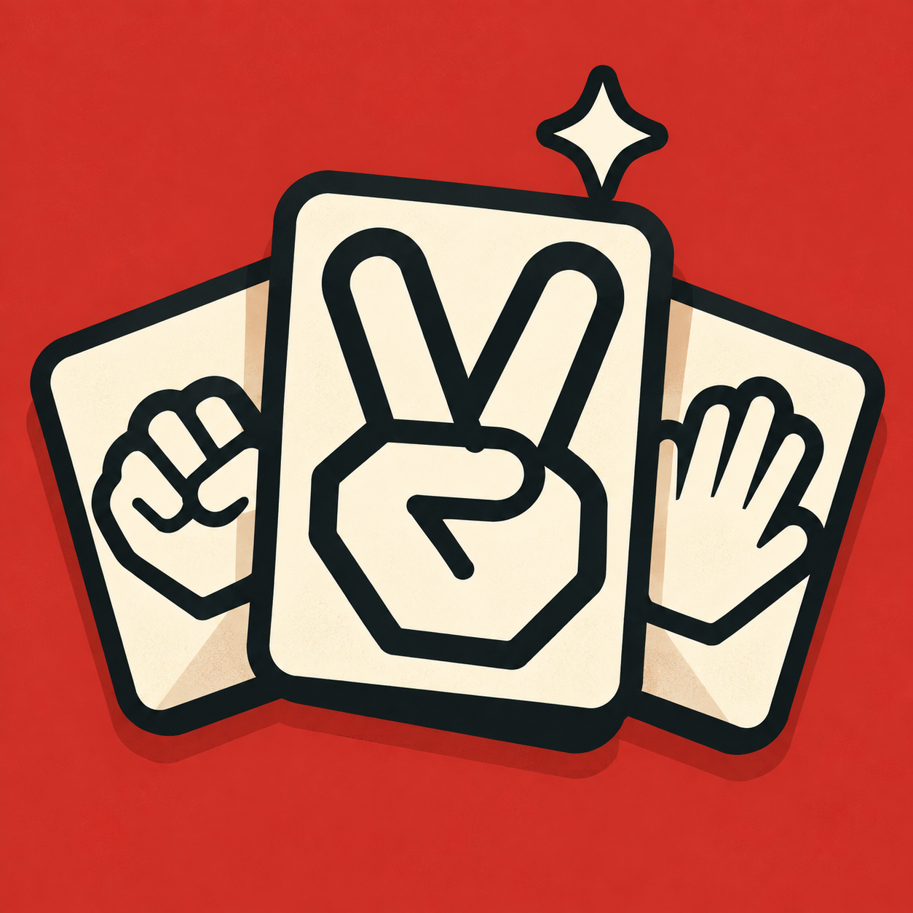

# Make Games with Sichuang
### 一桌点子

**Play something familiar. Change a rule. Make a game of your own.**

[Visit the website](https://luozhuo-tabletop-design.vercel.app/#course/reading/all/en) · [Play Rule Lab](https://luozhuo-tabletop-design.vercel.app/#play/en) · [简体中文](README.zh-CN.md)

What if you rolled two dice in Snakes and Ladders, but could only use one? What if losing a hand of Rock–Paper–Scissors still helped you capture a space?

A small rule can give you a different game. **Make Games with Sichuang** is a place to explore those changes: play, read, make a rough prototype, and find out what happens when someone else tries it.

Start with a game you already know. You can follow a course from the first rule to a playable version, or come with one question and find an example that helps. The courses, essays, and case studies are available in **English and Chinese**.

## A game for learning game design

**Rock–Paper–Scissors is just the first hand.**

In Rule Lab, you play against the computer, then choose a change. Add a resource. Try a character ability. Put cards and territory into the same game. Play again and notice which decisions become easier, harder, or more interesting.

When rollback becomes available, remove a rule and compare. You are building an understanding of your own version, one choice at a time.

**[Play Rule Lab →](https://luozhuo-tabletop-design.vercel.app/#play/en)** · [Watch the 24-second introduction](https://luozhuo-tabletop-design.vercel.app/#play/en)

*The game and film currently use Chinese. The introduction is bilingual. No account is needed; refreshing or leaving the game resets the session.*

## Choose your way in

| I want to… | Start here |
| --- | --- |
| **Make my first game** | [Follow the 28-chapter course](https://luozhuo-tabletop-design.vercel.app/#course/reading/all/en). Start with Snakes and Ladders, add choices, build a paper prototype, and prepare it for another player. |
| **See why a game works** | [Explore 18 game studies](https://luozhuo-tabletop-design.vercel.app/#resources/cases/all/en), from Carcassonne and Azul to The Crew and Spirit Island. Follow an actual decision and the rules around it. |
| **Understand a design problem** | [Browse 96 articles on mechanisms, themes, and learning](https://luozhuo-tabletop-design.vercel.app/#resources/library/all/en). Look at what a rule asks players to do, and what it costs them. |
| **Try an idea right now** | [Play Rule Lab](https://luozhuo-tabletop-design.vercel.app/#play/en), or use a course exercise to sketch the next version of your game. |

The course also includes a complete **28-chapter river-crossing alternative** and **13 further-reading essays**. Exercises open when you want them. Switch languages without losing your place in a lesson.

## From “that felt odd” to “let’s try this”

A player hesitates. A round takes longer than you expected. Everyone keeps choosing the same move.

These are useful places to begin. The lessons connect moments like these to choices, information, resources, pacing, and playtesting. You will find worked examples, small exercises, and questions to take to the table. You do not need to know design terminology before you start.

The writing is original, with references for further reading. Examples and designer judgments have context; they are invitations to investigate, rather than promises that a rule will work in every game.

## Bring a game, a question, or a pencil

Read on your own, compare a familiar game with friends, or take a question into a workshop. A few paper pieces and something to write with are enough for many of the course exercises.

**[Pull up a chair. Let’s make a game.](https://luozhuo-tabletop-design.vercel.app/#course/reading/all/en)**

---

**一桌点子**：从熟悉的一局开始，玩一玩、改一条规则，再做出自己的小游戏。这里有中英文课程、真实桌游案例，以及可以亲手改规则的猜拳游戏。

[进入中文网站](https://luozhuo-tabletop-design.vercel.app/#course/reading/all/zh-CN) · [阅读完整中文介绍](README.zh-CN.md) · [Maintenance notes](docs/DEVELOPMENT.md)
