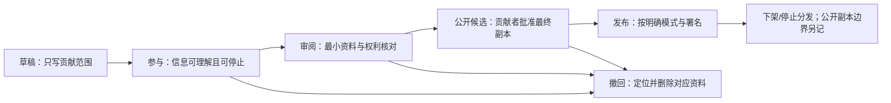

# 玩家经验与设计案例贡献包

状态：protocol-prototype  
日期：2026-08-19  
实现范围：离线 JSON 模板、机器守卫和编辑流程；不收集、不上传、不自动发布。

## 为什么现在只做离线协议

当前网站的 MVP 明确排除公开投稿与审核后台。直接增加表单会引入真实身份、健康/障碍资料、儿童安全、权利许可、撤回和运营响应义务，而项目尚未具备相应治理与专业审查。

本轮先验证“需要哪些决定和字段”，而不是验证“能否收集更多内容”。模板只能保存在使用者自己的设备或由明确负责的研究者保管；不得放进公开仓库。

## 五道门



### 1. 草稿门

只记录贡献类型、项目范围、版本/地点/任务语境与为什么需要这份材料。联系信息和真实姓名不进入可分享 JSON；贡献 ID 与联系人映射必须单独保存。

### 2. 参与门

在开始访谈、共同分析或收取文件前，分别说明：参与内容、原始资料、保存期限、会接触资料的人、可跳过/停止、补偿与开支、撤回方式。信息说明需要使用贡献者选择的格式与沟通方式。

### 3. 审阅门

编辑者检查：

- 事实、版本和来源能否定位；
- 第一人称、机构转述和编辑推断是否分开；
- 是否收集了回答问题并不需要的身份或健康资料；
- 第三方文字、图片、规则、课程材料和共同作者权利是否明确；
- 贡献角色、署名偏好、补偿和未采用意见是否记录；
- 是否出现儿童或其他需要额外保护的参与者。

### 4. 公开候选门

贡献者看到实际将公开的副本，而不是只看最初提问。参与、匿名摘要、逐字引语、媒体和公共许可分别确认。任何一项仍为默认拒绝时，状态不能升级。

涉及儿童或额外保护参与者时，普通模板无权通过此门，必须先取得专业安全保障/伦理审查，并记录监护人许可与参与者本人同意表达。

### 5. 发布门

公开页同时显示贡献类型、语境、贡献者角色、署名方式、编辑改动、证据边界、核验日期、发布模式与撤回入口。不显示私有联系映射、原始同意记录或不必要的敏感资料。

## 四种发布模式

| 模式 | 网站可以做什么 | 默认 | 撤回边界 |
|---|---|---:|---|
| `review_only` | 内部审阅，不公开内容 | 是 | 公开前删除工作资料与映射 |
| `link_and_summary` | 链接贡献者已公开的原页，发布本站原创摘要 | 否 | 下架本站摘要；外部原页由原发布者控制 |
| `approved_excerpt` | 只发布贡献者批准的指定引语或片段 | 否 | 下架本站片段；无法保证缓存和合法引用消失 |
| `cc_by_4_0` | 按贡献者明确选择的 CC BY 4.0 公开完整指定材料 | 否 | 可停止本站分发，但不能撤销他人已取得的许可 |

模板不提供“网站取得全部权利”选项。具体许可和司法辖区问题需专业审查；机器守卫只能阻止明显缺项，不能证明授权有效。

## 数据分区

| 分区 | 内容 | 是否可进入公开 JSON |
|---|---|---:|
| 贡献包 | 稳定 ID、语境、角色、审阅状态、公开副本、边界 | 通过候选门后按字段白名单 |
| 联系映射 | 真实姓名、邮箱/电话、撤回联系方式 | 否；独立受控保存 |
| 同意证据 | 签署/口头同意记录、信息说明版本 | 否；只在公开包留下是否完成和版本 |
| 原始资料 | 录音、录像、逐字稿、原文件 | 否；默认不收集，设最短保留期 |
| 删除记录 | 请求日期、处理范围、完成日期、无法回收边界 | 只公开非识别性的状态说明 |

## 机器可读文件

- `contribution-package-schema.json`：允许值、状态门与默认拒绝规则；
- `contribution-package-template.json`：一份默认私有、未取得同意、未选择许可的空白贡献包；
- `scripts/validate-contribution-package.mjs`：检查安全默认值，并用构造案例验证发布候选门会拒绝缺少同意、最终副本批准、第三方权利和儿童安全审查的资料。

运行：

```bash
pnpm contribution:check
```

## 不做的事

- 不生成代表性、可信度、贡献价值或“伦理通过”总分；
- 不把匿名自动等同于可公开；
- 不把签名自动等同于理解或持续同意；
- 不把提供经历自动等同于同意编辑分析；
- 不把 CC 许可预选为开放默认；
- 不承诺删除已经下载、缓存或按不可撤销许可传播的所有副本；
- 不用普通模板处理儿童或高风险资料的公开；
- 不把机器校验写成法律、伦理或儿童保护审查。

## 形成性测试

正式实现前至少与以下 5–7 人走读模板：残障玩家或组织者、桌游设计日志作者、课程资料贡献者、社区编辑/翻译者、隐私或版权专业人员。观察他们是否能用自己的话回答：

1. 当前只同意了参与、保存、引用还是开放许可？
2. 网站准备公开的具体文本在哪里？
3. 怎样选择实名、化名、集体署名或不署名？
4. 撤回时本站能删除什么，不能保证删除什么？
5. 贡献者的分析、验证与编辑劳动怎样被记录和补偿？

任何人把“匿名”“内部审阅”或“CC”误解为同一件事，都视为协议问题，不归咎参与者。

研究依据见[玩家经验与设计案例贡献研究](../research/CONTRIBUTION_ETHICS_01.md)。
