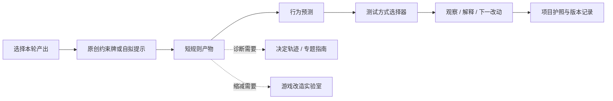

# 产品规格：设计辅助练习闭环

状态：候选产品规格，未进入可视界面实现  
日期：2026-08-18  
研究依据：`docs/research/DESIGN_AID_PRODUCTS_02.md`

## 一句话定义

这不是新的随机灵感器，而是一层轻量编排：帮助用户先选辅助工具的工作，再把一个提示变成规则产物、行为预测、实际测试与下一步修订。

## 要解决的问题

现有网站已经有原创设计约束牌、游戏改造实验室、测试方式选择器、决定轨迹、反馈记录和项目护照。但它们各自成立，新手仍可能：

- 抽到一张牌后停在“挺有意思”；
- 把诊断问题误当改法；
- 做出组件却没有测试问题；
- 把完成练习或收到赞成票当作设计有效；
- 无法把一次练习留在项目版本里。

## 核心原则

1. **先选工作，再选工具**：生成、诊断、原型、练习、测试不能用同一按钮含混处理。
2. **提示可拒绝**：跳过、重抽和自行输入是正常动作，不带失败惩罚。
3. **每轮只保护一个输出**：概念候选、诊断问题、最低规则产物或测试记录四选一。
4. **不设置设计师分数**：完成步骤、被同伴猜中或受欢迎都不等于设计质量。
5. **提示必须离场**：进入测试时界面突出规则、预测和观察，不继续突出抽到的牌。
6. **单人模式不冒充外部证据**：自我讲解和自测清楚标记为准备动作。
7. **反思默认私有**：只有用户主动选择的字段才能进入分享导出。

## 四种入口模式

| 模式 | 用户真实问题 | 复用的现有能力 | 本轮产出 |
|---|---|---|---|
| 生成候选 | “我没有可动手的方向” | 原创设计约束牌 | 两个候选＋拒绝/保留理由 |
| 诊断原型 | “能玩，但不知道哪里失效” | 专题指南、决定轨迹 | 一个可观察问题＋反例信号 |
| 缩成原型 | “规则太多，今天做不出来” | 游戏改造实验室、最小原型指南 | 可在短时间运行的规则与组件清单 |
| 完成练习闭环 | “我想系统练一次设计” | 以上三项＋测试方式选择器＋项目护照 | 规则产物、预测、观察和下一改动 |

“查词汇”和“找组件”保留为资源入口，不在第一版闭环中做独立交互模式；它们没有自然的完成状态。

## 状态流程

### 0. 绑定项目与版本

- 选择现有项目或创建临时练习。
- 默认写入当前版本；临时练习不自动污染正式版本。
- 展示证据状态：`练习准备 / 自测 / 外部测试`。

### 1. 选择当前工作

界面只问：“这轮结束时，你希望桌上多出什么？”

- 两个可比较的方向；
- 一个更具体的问题；
- 一份能运行的短规则；
- 一条来自实际游玩的观察。

系统由答案映射模式，而不是先展示工具名称。

### 2. 写边界

必填：目标玩家、目标体验、本轮时限。  
可选：人数、材料、生产、安全或无障碍硬边界。

系统提醒：提示不能覆盖硬边界；不合适时直接跳过。

### 3. 取得或自拟一个临时提示

- 默认一次显示一张原创提示；
- 可“保留”“换一张”“自己写”；
- 换牌时可选填一句拒绝理由；
- 连续换三张后，不继续制造抽卡循环，改为让用户缩小工作或自行输入。

第一版只复用本站原创约束牌，不导入商业卡组文本。

### 4. 生成规则产物

不同模式显示不同最小字段：

- 生成：玩家动作、直接后果、为何可能服务目标体验；
- 诊断：当前症状、发生局面、待观察动作、反例信号；
- 原型：开局、每回合可做什么、怎样结束、最低组件；
- 闭环：使用“开局—回合—结束—查询”短规则表。

仅有题材描述或机制名称不能进入下一步。

### 5. 写行为预测

句式：`如果这项规则在当前玩家与局面中起作用，我预计会观察到……；如果没有起作用，可能会看到……。`

预测不是承诺，也不自动成为测试结论。

### 6. 选择最低成本测试

调用现有测试方式选择器，并预填本轮问题：

- 规则仍不闭合：自测或规则走查；
- 想看决定是否发生：引导测试；
- 想看能否自主学习：局部或完整盲测；
- 没有测试者：保存招募条件，不生成模拟玩家结论。

### 7. 记录观察与反思

分开四栏：

- 实际发生的动作；
- 玩家原话或自身体验；
- 当前解释；
- 下一版只改什么。

最后问：“提示在实际行为里可见吗？”选项为 `可见 / 部分可见 / 不可见 / 这轮没测试这个`，不计分。

## 建议数据结构

```json
{
  "sessionId": "local-generated-id",
  "projectId": "optional-project-id",
  "versionLabel": "v0.3",
  "mode": "generate|diagnose|prototype|practice_loop",
  "desiredOutput": "short user statement",
  "boundaries": {
    "targetPlayers": "",
    "experienceIntent": "",
    "timeboxMinutes": 30,
    "hardConstraints": []
  },
  "prompt": {
    "source": "original_constraint_deck|user_written",
    "promptId": "optional",
    "rejectedPromptIds": [],
    "rejectionNotes": []
  },
  "artifact": {
    "setup": "",
    "turn": "",
    "end": "",
    "lookup": ""
  },
  "prediction": {
    "supportingSignal": "",
    "counterSignal": ""
  },
  "test": {
    "evidenceStatus": "preparation|self_test|external_test",
    "method": "",
    "participantContext": "",
    "observedActions": [],
    "participantWords": []
  },
  "interpretation": "",
  "nextSingleChange": "",
  "reflectionVisibility": "private"
}
```

正式实现前要把它纳入项目工作区 schema 迁移；当前文档不是已承诺的数据兼容格式。

## 复用关系



## 不进入第一版的内容

- 商业卡组内容导入；
- AI 模拟玩家或自动生成“测试反馈”；
- 排行榜、徽章、连续签到和设计师总分；
- 自动评价创意质量；
- 公开反思墙；
- 组件购买推荐和动态价格；
- 多人实时协作编辑。

## 无障碍与安全要求

- 全流程可键盘操作，抽牌动画可以关闭；
- 不用颜色单独表示证据状态或模式；
- 时间盒是建议，不强制倒计时；
- 所有提示均有跳过和自行输入；
- 反思模式启动前说明可能涉及的记录与可见范围；
- 用户可单独删除反思，不必删除项目；
- 导出前逐项确认私有字段；
- 多人主持时提供“不解释即可退出”的提示语。

## 验收条件

1. 新手能在不认识工具名称的情况下，先选出本轮希望得到的产物。
2. 用户可以不采用任何系统提示并完成流程。
3. 流程不能在没有规则产物和行为预测时标记“准备测试”。
4. 自测与外部测试在界面、存储和导出中不可混淆。
5. 完成页面不出现设计质量分数或“通过”判断。
6. 项目记录能还原本轮采用、拒绝的提示和下一版单一改动。
7. 反思回答默认不进入公开或分享导出。

## 发布门

只有完成 `USABILITY_TEST_DESIGN_AID_LOOP.md` 的首轮任务测试，并至少修复“模式误选”“提示被当命令”“自测被当证据”三个严重问题后，才进入界面实现。

