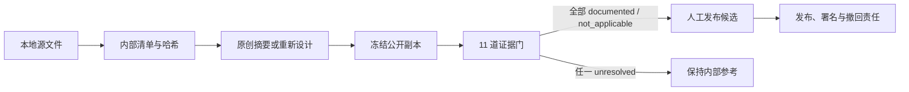

# 本地课程内容发布门禁

状态：implemented / internal governance  
日期：2026-08-21

## 产品决定

本地课件不是网站内容库，也不是待批量上传的素材目录。它们是内部研究证据。公开站点只能接收另行编写、已冻结并通过逐项复核的“公开副本”；源文件默认永远不会因为被索引、被阅读或被用户拥有而自动公开。



## 数据分工

| 文件 | 权威职责 | 不承担的职责 |
|---|---|---|
| `manifest.json` | 文件相对路径、格式、大小、修改时间、哈希、重复组 | 不证明作者、权属或许可 |
| `publication-readiness.json` | 每个清单文件是否经过审计、资料群门禁、当前决定、问题与候选 | 不存原文、合同、联系方式或法律结论 |
| 公开副本（未来） | 网站实际准备发布的独立内容与固定哈希 | 不复用源文件哈希冒充公开副本 |
| 受控证据库（未来） | 合同、授权、同意与联系人映射 | 不进入公开仓库 |

`materials` 必须与清单一一对应。新增本地文件后，清单校验会失败，直到它被加入审计；删除或改名也会触发不一致。资料群 `profile` 提供默认决定和 11 道门，单文件特殊情况只能通过显式 `overrides` 记录，不能靠文件名猜测。

## 状态机

| 状态 | 含义 | 能否公开 |
|---|---|---:|
| `internal_reference_only` | 仅内部研究；可另写原创摘要 | 否 |
| `permission_review_required` | 已确定拟公开范围，但权利/隐私证据未齐 | 否 |
| `public_copy_candidate` | 已冻结独立公开副本，等待全部证据与责任人 | 否 |
| `approved_for_publication` | 机器字段完整且人工复核已记录 | 仍需发布负责人执行；机器不作法律批准 |
| `withdrawn` | 停止使用或下架 | 否 |

状态不按分数累计；一项高风险门不能被十项低风险门抵消。`approved_for_publication` 也只适用于指定公开副本、范围、日期和证据，不能反向批准源文件或同资料群其他文件。

## 候选最小结构

```yaml
materialKey: collection-id/relative-path
decision: approved_for_publication
publicCopyId: stable-public-copy-id
publicCopySha256: 64-character-sha256
reviewedAt: YYYY-MM-DD
reviewerRole: string
withdrawalOwner: string
gateEvidence:
  authorship: evidence-id
  coCreatorRights: evidence-id
  institutionalOrCommissioningRights: evidence-id
  thirdPartyText: evidence-id
  thirdPartyMedia: evidence-id
  personalInformation: evidence-id
  minorSafeguarding: evidence-id
  publicationCopy: evidence-id
  attribution: evidence-id
  licenseOrPermission: evidence-id
  withdrawalOwner: evidence-id
```

证据 ID 只指向受控证据登记，不把合同、未成年人信息、授权人联系方式或原始同意文件写进仓库。公开副本的哈希必须不同于“只索引源文件”的角色；它证明审阅对象固定，不证明内容合法。

## 构建门

- `scripts/validate-content.mjs`：检查审计模型存在、默认内部使用、直接发布关闭、发布候选为空，以及 57 个文件一一覆盖；
- `scripts/check-local-publication-readiness.mjs`：检查四个资料群、11 道门、允许值、绝对路径/原文禁入、完整候选结构与拒绝分支；
- `pnpm content:check`：在所有生产构建前同时运行本门禁和既有贡献包门禁；
- `pnpm local-publication:check`：单独运行本门禁。

当前预期输出是 `57 materials, 4 profiles, 19 guards`。这代表静态合同成立，不代表律师、学校、共同作者、学生或监护人已经批准。

## UI 边界

本轮不把本地资料清单或文件名展示在公开网站，也不增加上传按钮。未来若加入编辑后台，应只显示非敏感稳定 ID、决策状态、缺失门和公开副本预览；源文件下载、合同、联系人、学生资料与同意证据必须保持权限隔离。

## 变更规则

1. 不直接编辑生成的 `manifest.json` 来“通过”权利审查；
2. 不把 `unresolved` 改成 `not_applicable` 作为清理待办；必须记录理由和审阅人；
3. 不用源文件元数据、SHA-256、持有事实或历史课堂用途当授权证据；
4. 不预选 CC。只有有权许可的权利人理解其不可撤销性并明确选择后，才记录具体许可；
5. 实际运营前必须让版权、隐私与未成年人保护专业人员分别复核适用地区与流程。

