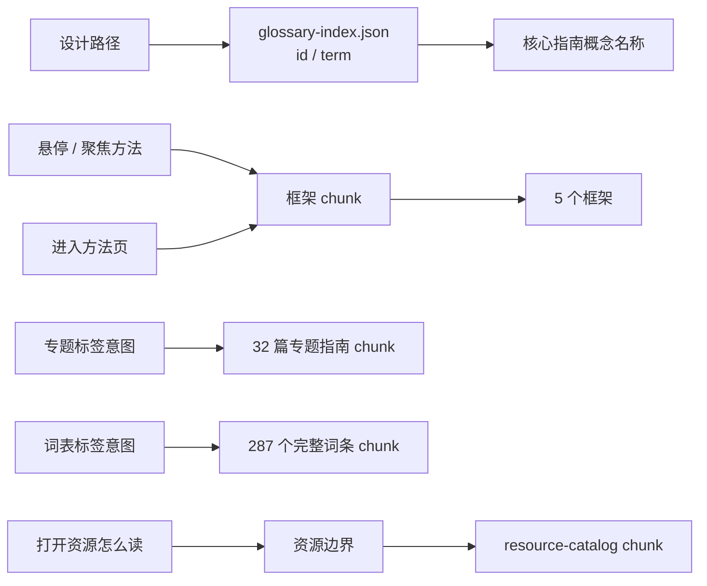

# 方法页按需加载与轻量概念索引

状态：implemented / browser verification pending  
日期：2026-08-20  
前置优化：[资源库按需加载与轻量来源索引](RESOURCE_LAZY_LOADING.md)

## 问题

完整资源目录拆出后，首屏主 JS 已从 798.86 kB 降至 554.34 kB，但仍超过 500 kB。剩余的大型静态内容中，当前 287 个完整概念词条、31 篇专题指南和 5 个理论框架只在“方法”页使用；设计路径的核心指南只需要根据概念 ID 显示概念名称。

如果继续让完整词条和专题指南静态进入首屏，用户即使只使用设计路径或工具箱，也要下载定义、反例、关联来源、专题步骤、误区和练习全文。

## 决定

采用与资源目录一致的两层结构：

1. `content/glossary-index.json` 只保留概念 `id` 与 `term`，供核心指南显示“本阶段概念”；
2. 框架、完整词表和专题指南各自组成动态 chunk；
3. 用户悬停或键盘聚焦“方法”导航时只预取默认框架；词表和专题指南由各自标签的悬停、聚焦或打开意图触发；
4. 加载失败显示明确错误与重试，不把失败表现为空方法页；
5. “资源怎么读”仍是第二层动态边界：进入方法页只加载默认框架，只有选择该标签时才加载完整资源目录。

## 生成与校验

- `scripts/generate-glossary-index.mjs` 从 `content/glossary.json` 生成索引；
- `pnpm glossary:index` 单独重建概念索引；
- `pnpm content:indexes` 同时重建资源与概念索引；
- 内容校验器逐条比较索引长度、顺序、ID、术语和字段范围；
- `glossary-index.json` 是生成物，不接受手工定义、别名、关系或独立排序。

## 产物变化

| 产物 | 资源拆分后 | 方法拆分后 | 本轮变化 |
|---|---:|---:|---:|
| 首屏主 JS | 554.34 kB | 417.02 kB | -137.32 kB（-24.8%） |
| 首屏主 JS gzip | 172.14 kB | 125.57 kB | -46.57 kB（-27.0%） |
| 方法目录 chunk | 无独立文件 | 141.59 kB | 方法意图后加载 |
| 方法目录 gzip | 无独立文件 | 50.15 kB | 方法意图后加载 |
| 资源目录 chunk | 280.75 kB | 280.75 kB | 不变 |

与两次拆分前的 798.86 kB（gzip 234.25 kB）相比，首屏主 JS 原始大小共减少 381.84 kB（47.8%），gzip 共减少 108.68 kB（46.4%）。生产构建不再出现大于 500 kB 的 chunk 警告。

这些数字是构建产物大小，不是加载时长、交互响应或 Core Web Vitals。方法预取是否改善真实连接上的感知速度仍需浏览器测量。

## 文件责任

- `content/glossary.json`：完整概念的唯一权威来源；
- `content/glossary-index.json`：首屏使用的生成索引；
- `src/data.ts`：核心指南、轻量来源/概念索引与共享类型；
- `src/framework-catalog.ts`、`src/glossary-catalog.ts`、`src/special-guide-catalog.ts`：三个独立数据边界；
- `src/method-loader.ts`：三路动态导入、请求去重和独立失败重试；
- `src/App.tsx`：立即可用的方法页外壳、标签意图预取、分区状态 UI 和数据消费者；
- `scripts/check-method-section-loading.mjs`：18 项分片、预取、恢复与语义守卫；
- `scripts/qa-site.cjs`：访问意图前后 chunk 请求与既有方法内容契约。

## 加载与无障碍要求

- 鼠标悬停和键盘聚焦具有同等预取行为；
- 加载状态使用 `role=status`，错误使用 `role=alert`；
- 错误文本说明设计路径、工具和本地记录仍可用；
- 重试会创建新的导入 Promise，不复用已经拒绝的 Promise；
- 加载完成后保留方法页原有的标签顺序、标题层级和筛选语义；
- 不用骨架屏伪造已经取得的内容条数或阅读进度。

## 验证

已验证：

- 94 条轻量概念索引与权威词表逐条一致；
- TypeScript 独立检查通过；
- 首版生产构建曾生成 141.59 kB 的独立 `method-catalog` chunk；该整包边界已被文末的标签级分片取代；
- 只存在于完整词条中的“不是统一的‘粗糙—精美’单轴”只命中方法 chunk；
- 主包降至 417.02 kB，500 kB 警告消失；
- QA 脚本等待方法目录可用，并新增加载前/后的资源请求断言；脚本语法通过。

尚未验证：

- 当前环境的 preview 本轮 60 秒内未就绪，因此没有运行浏览器断言；
- 方法预取时序、失败重试、焦点保持和资源二级加载尚未有真实浏览器证据；
- 未记录慢速网络、缓存命中与首次/再次访问的性能差异。

## 下一步

主包此前已低于警告线；加入第 13 项工具后仍不为了数字立即大规模搬动工具。下一性能动作应先取得真实浏览器的网络瀑布和交互记录；若工具页面形成明显长任务，再按工具 ID 拆分组件，并为鼠标和键盘意图预取。内容可理解性和真实新手任务测试仍优先于继续压缩构建数字。

2026-08-21 后续增量：四个方法分区和 898 个当前条目已支持 `#method/<section>/<item-id>` 深链。路由受控状态没有改变四个加载边界；`pnpm qa:method-sections` 仍为 18/18，新增 `pnpm qa:method-deep-links` 10/10。本轮构建主 JS 为 493.25 kB（gzip 151.94），方法 chunk 尺寸不变。

2026-08-21 概念行动增量：从 287 个词条与 38 篇指南生成的行动索引与完整词表共用 `glossary-catalog` 分片。词表分片由 257.44 kB（gzip 74.55）增至 309.01 kB（gzip 80.04）；原始增加 51.57 kB，gzip 只增加 5.49 kB。专题全文分片仍为 245.80 kB（gzip 93.37），只有概念用户实际点击专题时才加载；主 JS 为 494.94 kB（gzip 152.43），仍低于 500 kB。12/12 关系守卫证明静态边界，真实请求时序仍待浏览器验证。

## 2026-08-20 内容增长快照

在 135 个完整词条、21 篇专题指南、331 条资源与 331 条审阅下，条件加载边界保持不变。最新生产构建为：主 JS 441.56 kB（gzip 134.68）、方法目录 288.36 kB（gzip 99.97）、资源目录 468.84 kB（gzip 128.39）、CSS 48.74 kB（gzip 8.30）。这些数字只属于构建产物，不是网络或交互性能证据，没有因内容增长改动预取或拆包策略。

在 158 个完整词条、23 篇专题指南、367 条资源与 367 条审阅下，条件加载边界保持不变。最新生产构建为：主 JS 449.46 kB（gzip 137.24）、方法目录 329.38 kB（gzip 113.45）、资源目录 519.93 kB（gzip 141.98）、CSS 48.74 kB（gzip 8.30）。资源目录超过 500 kB 并触发构建警告；这些数字只属于构建产物，不是网络或交互性能证据。本轮没有为谈判内容增长改动预取或拆包策略，下一步应先在浏览器可用环境取得网络瀑布和长列表交互证据，再决定是否继续分片。

在 173 个完整词条、24 篇专题指南、387 条资源与 387 条审阅下，条件加载边界保持不变。最新生产构建为：主 JS 453.44 kB（gzip 138.50）、方法目录 352.35 kB（gzip 120.26）、资源目录 547.26 kB（gzip 148.68）、CSS 48.74 kB（gzip 8.30）。资源目录继续超过 500 kB 并触发构建警告；这些数字只属于构建产物，不是浏览器网络、长任务或交互性能证据。本轮没有因竞价内容增长改动预取或拆包策略，需先在浏览器可用环境取得网络瀑布和长列表证据。

在 188 个完整词条、25 篇专题指南、409 条资源与 409 条审阅下，条件加载边界保持不变。最新生产构建为：主 JS 458.05 kB（gzip 140.00）、方法目录 372.26 kB（gzip 126.41）、资源目录 575.12 kB（gzip 155.06）、CSS 48.74 kB（gzip 8.30）。资源目录继续超过 500 kB 并触发构建警告；这些数字只属于构建产物，不是浏览器网络、长任务或交互性能证据。本轮没有因市场内容增长改动预取或拆包策略，仍需先在浏览器可用环境取得网络瀑布和长列表证据。

在 204 个完整词条、26 篇专题指南、428 条资源与 428 条审阅下，条件加载边界保持不变。最新生产构建为：主 JS 462.00 kB（gzip 141.20）、方法目录 393.22 kB（gzip 132.62）、资源目录 599.86 kB（gzip 160.55）、CSS 48.74 kB（gzip 8.30）。资源目录继续超过 500 kB 并触发构建警告；这些数字只属于构建产物，不是浏览器网络、长任务或交互性能证据。本轮没有因生产链内容增长改动预取或拆包策略，仍需先在浏览器可用环境取得网络瀑布和长列表证据。

在 221 个完整词条、27 篇专题指南、446 条资源与 446 条审阅下，条件加载边界保持不变。最新生产构建为：主 JS 465.64 kB（gzip 142.24）、方法目录 415.58 kB（gzip 139.52）、资源目录 623.90 kB（gzip 166.59）、CSS 48.74 kB（gzip 8.30）。资源目录继续超过 500 kB 并触发构建警告；这些数字只属于构建产物，不是浏览器网络、长任务或交互性能证据。本轮没有因隐藏信息内容增长改动预取或拆包策略，仍需先在浏览器可用环境取得网络瀑布、长列表与动态目录交互证据。

在 239 个完整词条、28 篇专题指南、469 条资源与 469 条审阅下，条件加载边界保持不变。最新生产构建为：主 JS 470.02 kB（gzip 143.52）、方法目录 439.06 kB（gzip 146.47）、资源目录 654.32 kB（gzip 173.89）、CSS 48.74 kB（gzip 8.30）。资源目录继续超过 500 kB 并触发构建警告；这些数字只属于构建产物，不是浏览器网络、长任务或交互性能证据。本轮没有因牌库构筑内容增长改动预取或拆包策略，仍需先在浏览器可用环境取得网络瀑布、长列表、动态目录和 23 个入口导航证据。

在 257 个完整词条、29 篇专题指南、494 条资源与 494 条审阅下，条件加载边界保持不变。最新生产构建为：主 JS 474.97 kB（gzip 145.21）、方法目录 461.90 kB（gzip 153.07）、资源目录 686.92 kB（gzip 182.04）、CSS 48.74 kB（gzip 8.30）。资源目录继续超过 500 kB 并触发构建警告；这些数字只属于构建产物，不是浏览器网络、长任务或交互性能证据。本轮没有因卡牌语言内容增长改动预取或拆包策略，仍需先在浏览器可用环境取得网络瀑布、长列表、动态目录和 24 个入口导航证据。

在 275 个完整词条、30 篇专题指南、519 条资源与 519 条审阅下，条件加载边界保持不变。最新生产构建为：主 JS 480.02 kB（gzip 146.78）、方法目录 484.41 kB（gzip 160.44）、资源目录 718.35 kB（gzip 189.54）、CSS 48.74 kB（gzip 8.30）。资源目录继续超过 500 kB 并触发构建警告；这些数字只属于构建产物，不是浏览器网络、长任务或交互性能证据。本轮没有因卡池版本治理内容增长改动预取或拆包策略，仍需先在浏览器可用环境取得网络瀑布、长列表、动态目录和 25 个入口导航证据。

在 281 个完整词条、30 篇专题指南、527 条资源与 527 条审阅下，条件加载边界保持不变。第 14 项工具独立为 17.16 kB（gzip 5.81）的按需 chunk；最新生产构建为主 JS 484.08 kB（gzip 147.94）、方法目录 488.98 kB（gzip 161.60）、资源目录 729.87 kB（gzip 192.79）、CSS 61.03 kB（gzip 10.22）。资源目录继续超过 500 kB 并触发构建警告；这些数字只属于构建产物，不是浏览器网络、长任务或交互性能证据。下一步仍需先取得网络瀑布、长列表和 26 个入口导航证据。

在 287 个完整词条、31 篇专题指南、533 条资源与 533 条审阅下，条件加载边界保持不变。最新生产构建为主 JS 485.70 kB（gzip 148.47）、方法目录 502.34 kB（gzip 166.55）、资源目录 739.62 kB（gzip 195.67）、CSS 61.03 kB（gzip 10.22）。方法和资源目录都触发 500 kB 构建警告，但它们仍是按导航意图加载的独立 chunk；这不证明真实网络或交互性能。下一步先取得网络瀑布、长列表和 27 个入口导航证据，再决定是否按专题或入口继续分片。

2026-08-21 当前增量：方法目录现含 287 个词条、32 篇专题指南和 5 个理论框架；新增阅读—行动专题后，主 JS 仍为 502.95 kB（gzip 153.94），方法目录为 509.75 kB（gzip 169.46），资源目录为 803.83 kB（gzip 213.93），CSS 为 118.08 kB（gzip 17.89）。条件加载边界仍在；方法/资源 chunk 超过 500 kB 仍需真实网络瀑布和交互时序后再决定分片。

## 2026-08-21 标签级分片

上述 509.75 kB 整包已在本轮被取代。生产构建现生成：

- 框架 6.51 kB（gzip 3.35），作为方法页默认内容；
- 专题指南 245.80 kB（gzip 93.37），仅在专题标签意图下加载；
- 完整词表 257.44 kB（gzip 74.55），仅在词表标签意图下加载。

默认方法入口的内容 chunk 原始体积减少 98.7%，gzip 减少 98.0%。主 JS 从 502.95 kB 小幅增至 503.42 kB（gzip 154.10），来自通用分区边界的运行时代价。`pnpm qa:method-sections` 18/18、TypeScript、完整内容门和生产构建已通过。本地端口 `EPERM` 使真实浏览器请求时序、慢网重试和焦点保持仍处于待验状态。详见[标签级分片交接](../handovers/2026-08-21-method-section-streaming.md)。

加入第 15 项“议题到系统工作台”后，内容计数不变，工具以 17.70 kB（gzip 5.70）的独立动态 chunk 按打开意图加载；主 JS 为 486.46 kB（gzip 148.64）、方法目录 502.36 kB（gzip 166.56）、资源目录 739.62 kB（gzip 195.67）、CSS 66.48 kB（gzip 10.72）。主包继续低于 500 kB；方法与资源目录警告不等于真实网络性能。没有因构建数字提前改动加载策略，仍需浏览器网络瀑布和交互证据。
