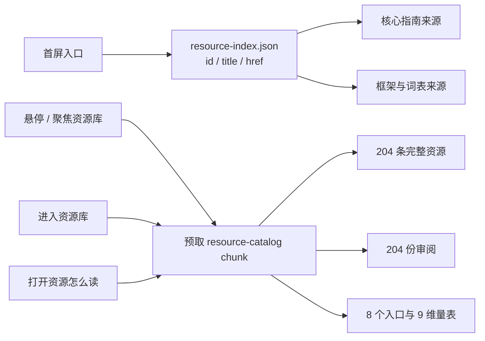

# 资源库按需加载与轻量来源索引

状态：implemented / browser verification pending  
日期：2026-08-18

## 问题

资源库增长到 204 条后，`resources.json`、逐资源审阅、八个入口和九维评价量表都通过 `src/data.ts` 静态进入首屏。即使用户只打开“设计路径”，也必须下载完整目录。拆分前的生产主 JS 为 798.86 kB（gzip 234.25 kB），并持续触发 500 kB 警告。

核心指南、理论框架和概念词表确实需要显示来源标题与原始链接，但不需要在首屏取得每条来源的作者、语言、适用阶段、摘要、限制和九维审阅。因此，完整数据和来源引用不是同一个加载需求。

## 决定

建立两层资源数据：

1. **轻量来源索引**：`content/resource-index.json`，每条只保留稳定 `id`、`title` 和 `href`；首屏指南、框架和概念来源链接使用这一层。
2. **完整资源目录**：资源、逐条审阅、策展入口和评价量表组成 `resource-catalog` 动态 chunk；只在资源库或“资源怎么读”工作台需要时加载。

不使用第二套手工台账。索引由 `content/resources.json` 机械生成，构建期验证顺序和三个字段逐条一致。



## 加载行为

- 用户悬停或键盘聚焦“资源库”主导航时调用预取；
- 没有预取时，进入资源库会立即开始动态导入；
- “方法”页本身不加载目录，只有悬停、聚焦或选择“资源怎么读”时才加载；
- 同一个 Promise 在页面生命周期中复用，避免重复请求；
- 导入失败会清除缓存 Promise，界面显示可重试状态；
- 失败不影响设计路径、工具和已经保存在浏览器里的项目记录；
- 加载状态使用 `role=status`，错误使用 `role=alert`，并保留明确的重试按钮。

## 长列表渲染

全部 204 条资源仍可同时筛选和搜索，但 `.resource-row` 使用：

```css
content-visibility: auto;
contain-intrinsic-size: auto 280px;
```

浏览器可以跳过屏幕外条目的布局与绘制，同时用估算高度维持滚动范围。这不是分页或虚拟列表：搜索结果数、DOM 顺序与键盘阅读顺序不变。需要在真实 Chrome、Safari、Firefox 和屏幕阅读器中继续核验支持差异。

## 产物变化

| 产物 | 拆分前 | 拆分后 | 变化 |
|---|---:|---:|---:|
| 首屏主 JS | 798.86 kB | 554.34 kB | -244.52 kB（-30.6%） |
| 首屏主 JS gzip | 234.25 kB | 172.14 kB | -62.11 kB（-26.5%） |
| 完整资源 chunk | 无独立文件 | 280.75 kB | 访问意图后加载 |
| 完整资源 chunk gzip | 无独立文件 | 75.50 kB | 访问意图后加载 |
| CSS | 48.55 kB | 48.74 kB | +0.19 kB |

这些是同一机器、同一 Vite 版本的生产构建产物大小，不是网络加载时间。预取是否在真实连接速度下改善体验仍需浏览器性能记录。

## 文件责任

- `scripts/generate-resource-index.mjs`：从权威资源 JSON 生成轻量索引；
- `content/resource-index.json`：生成物，不手工编辑；
- `scripts/validate-content.mjs`：验证索引长度、顺序、字段和内容；
- `src/data.ts`：首屏静态知识数据和资源引用类型；
- `src/resource-catalog.ts`：完整资源数据组装边界；
- `src/resource-loader.ts`：动态导入、Promise 去重、失败后允许重试；
- `src/App.tsx`：意图预取、加载/错误 UI 和目录消费者；
- `src/styles.css`：长列表渲染隔离。

## 内容维护流程

每次新增、删改或移动 `content/resources.json` 中的来源后：

```bash
pnpm resources:index
pnpm content:check
```

如果忘记生成，校验器会报告 `resource index: stale or reordered record ...; rerun pnpm resources:index`。健康快照仍由 `pnpm resources:health` 单独维护；轻量索引不改变资源核验日期或网络状态。

## 验证与未完成门

已验证：

- 索引与 204 条权威资源逐条一致；
- TypeScript 独立检查通过；
- 生产构建生成独立 `resource-catalog` chunk；
- 一条只存在于完整资源摘要中的文本只出现在该 chunk；
- QA 脚本新增“访问意图前未加载、进入资源库后已加载”的断言，语法通过。

未验证：

- 当前环境因 `listen EPERM 127.0.0.1:5175` 无法运行浏览器回归；
- 预取的真实时序、加载状态的焦点体验和失败重试尚无浏览器证据；
- `content-visibility` 的跨浏览器与辅助技术表现尚未人工验收。

## 后续性能包

2026-08-19 已继续把完整方法目录拆为独立 chunk，首屏主 JS 降至 417.02 kB（gzip 125.57 kB），500 kB 警告消失。后续不再为了数字立即搬动十二项工具；先取得真实浏览器网络瀑布和交互证据。详见 [方法页按需加载与轻量概念索引](METHOD_LAZY_LOADING.md)。

2026-08-21 完整目录已继续拆为 34 个策展入口包与显式“查看全部”边界。默认资源专属动态载荷为 18.95 kB（gzip 6.90），比原 803.83 kB 减少 97.6%。23/23 结构守卫与生产构建通过；真实浏览器请求时序仍待验。详见[入口级分片交接](../handovers/2026-08-21-resource-entry-streaming.md)。
