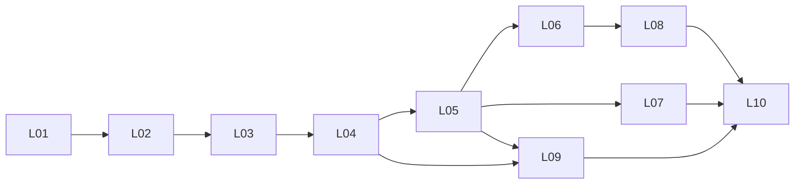

# 落桌资源库扩展施工计划

状态：规划交付；六篇真实游戏双语分析已在后续“阅读工具与案例升级”批次实现，核心主题与比较库仍待执行。日期：2026-09-08。范围：现有“游戏设计”项目的机制、示例、比较、主题与方法资源。当前课程仍为 28 章主线、13 篇选读。

2026-09-08 实施更新：已新增 Carcassonne、Pandemic、Dominion、6 nimmt!、Hanabi、Wingspan 六篇案例，各有中文和英文正文、官方规则版本、局面比较、课程与工具链接。28章已接入相关可选练习，阅读与案例页面已改版。六案例独立存放于 `content/design-cases/`，不计入原41篇课程/选读。首批24主题、6份跨机制比较、全部48主题尚未交付，首个里程碑仍未全部完成。后文基线保留为规划时快照，具体实现以 `docs/product/TEXT_DRIVEN_LEARNING_PATH.md` 和内部“阅读工具与案例升级”交付记录为准。

## 1. 要完成的事

把已有材料扩展成一个能查找、能看懂、能比较、能用于设计判断的双语资源库。读者可以不知道机制英文名，也不必拥有原书、玩过案例游戏或完成练习。每个内容对象只有一个语义版本，中文与英文对应发布；不按年龄复制文章。

沿用用户认可的课程主线，让小兔和小刺猬过河作为课程的连续案例。资源库通过课程上下文连接这条主线；机制差异不适合过河规则时，使用独立、完整说明的小局面，避免把所有机制硬加进同一款游戏。

示例比例暂采用“原创小局面为主，真实游戏比较为辅”的编辑建议。用户明确确认的是保留主线并使用贯穿案例；此前关于示例比例的可选问题尚未得到对应答复。比例可调整，不影响先建立身份、证据和版本规范。

**首个可用里程碑：24 个设计主题，每个都有双语解释和至少一个原创演示，另有 6 份跨机制比较、6 份经过官方规则核对的真实游戏应用档案。** 随后完成第二批 24 个主题，使总量达到 48；同时完成 12 个主题情境、12 份比较、12 份真实应用档案和 6 份方法示例。这里的数量是施工范围，不能作为“内容已完成”或“质量已通过”的标记。真实案例不齐时可先本地验收原创解释，但首个里程碑仍记为未全部完成。

## 2. 实测基线与缺口

以 [基线与文件指纹](/Users/shawn.fsc/Documents/ChatGPT/落桌内部研究/资源库扩展规划/inventory/baseline.json) 为本轮事实依据；旧文档里的 146 词条、387 来源等数字仅保留历史身份。

| 当前资产 | 实测数量 | 可复用之处 | 本轮发现的缺口 |
|---|---:|---|---|
| `content/design-materials.json` 机制卡 | 17 | 稳定 ID，动作、状态、取舍、风险与练习 | 中文短卡；练习常要求读者自行补规则，没有逐步演示；未提供逐卡证据身份 |
| 同文件主题卡 | 12 | 玩家位置、关系、系统压力、情境问题 | 中文；缺完整的规则映射与原创对照；现实题材需另查语境 |
| `content/glossary.json` | 287 | 基础概念、辨误、术语和指南关联 | 不是 287 个机制；不能直接全部改造成机制词条；需保持概念定义唯一 |
| `content/resources.json` | 574 | 外部资料记录与寻找来源的线索 | 目录数量不代表全文阅读、授权或内容已双语化 |
| `content/guides.json` / `special-guides.json` | 6 / 32 | 方法与已有系统问题的解释 | 与材料、词条、课程交叉；先整理关系，再决定是否补写 |
| 原创课程与选读 | 28 + 13 | 82 份双语正文、过河案例、站内阅读和语言路由 | 新资源应连接现有正文；无须再写一套课程 |
| Building Blocks 内部索引 | 203 | 全部条目定位、原文锚点和缓存 | 累计仅 65 条精读，其余 138 条仍为索引/主题覆盖 |

目前 `#learn/mechanics` 与 `#learn/themes` 已有页面；卡片按钮会调用 `seedFirstTabletopMaterial` 写入 `tabletop-workshop-first-tabletop-v1`，然后进入可选实践。新库的默认“阅读”和“查看示例”必须独立于这项写入行为。旧实践入口和已存 ID 应继续可用。另有已确认的接入风险：`App.tsx` 的项目读取会迁移旧草稿，挂载 effect 会写项目状态。L04 必须隔离这些写入，不能只保证新页面没调用 seed 就声称阅读无存储变化。

本轮建立了 48 个候选主题、17+12 张旧卡处置记录、287 个概念的保留记录，以及全部 203 条书内条目的规划映射。67 条书内条目与候选主题存在待核对关系，136 条暂未直接分配。**候选映射不是语义验证，也不是新增精读。** 不以出版物的 13 章或 203 条顺序决定本站分类。

## 3. 内容对象与阅读方式

| 对象 | 回答的问题 | 编辑边界 |
|---|---|---|
| 机制说明 `mechanism` | 玩家怎样做，状态怎样改变？ | 说明可操作规则与变体；不承诺某种感受必然出现 |
| 入口总览 `overview` | 几个相近说法有什么区别？ | 如“行动选择”“隐藏信息”；不能冒充单一机制 |
| 参与结构 `structure` | 谁决定、谁知道、谁与谁一起赢？ | 合作、团队、单人、战役，和动作机制分开标注 |
| 组合模式 `pattern` | 多个规则为什么配合或冲突？ | 写出各部分和条件，避免“机制 A + B = 好玩”的配方 |
| 基础概念 `concept` | 一个解释所用的词是什么意思？ | 延续 glossary 的概念身份；长文引用，不另建冲突定义 |
| 示例 `example` | 具体发生一次，会变成什么样？ | 原创完整小游戏、局部局面与真实应用分型，不混称试玩证据 |
| 比较 `comparison` | 改哪个条件，会失去或得到什么？ | 保持共同前提，逐项说明变化；组合也包括失败条件 |
| 主题情境 `theme` | 这些动作表达了怎样的关系？ | 延续 12 张卡；写玩家位置、被奖励/省略的关系和规则对照 |
| 方法示例 `method-example` | 怎样从问题走到下一次设计决定？ | 复用 6+32 指南；补有答案的示范，不新增强制工作单 |

读者有三个入口：按已知名称搜索（中英名、别名）；按“想让玩家做什么/正在遇到什么问题”浏览；从课程当前章节进入相关说明。第一层只呈现少量可理解的选择，更多筛选折叠。分类是编辑工具，不是普遍有效的机制本体。

建议保留现有顶层导航，在资源页内加入“文章 / 机制与结构 / 示例与比较 / 主题与方法”子入口；初期先把机制和示例放到位。导航最终命名在页面样板阶段检验，不增加学习步骤。资源浏览不需要创建项目、登录、打分或提交练习。

单篇阅读先给一句能懂的解释，马上走一次小局面，再解释取舍、边界、邻近机制和可选延伸。术语首次出现带短解释；不把证据 ID、解析信息或审批流程放进读者正文。

## 4. 内容范围与批次

完整列表、已有卡片、课程 ID、书内候选位置和状态见 [48 项待办](/Users/shawn.fsc/Documents/ChatGPT/落桌内部研究/资源库扩展规划/inventory/topic-backlog.json)。每项当前都是 `planned_not_written`。

| 问题组 | 六个候选主题 |
|---|---|
| 行动与时间 | 行动选择总览、行动点、工人放置、同时选择、行动编程、时间轨 |
| 手牌与抽取池 | 手牌管理、牌库构筑、轮选、袋中构成、多用途牌、吃墩 |
| 空间与连接 | 区域影响总览、区域多数、路线网络、板块放置、移动点、控制区 |
| 不确定性与信息 | 继续或停止、骰子分配、隐藏信息总览、推断、沟通限制、重掷锁定 |
| 资源与成长 | 共同资源压力、资源转换、收入生产、市场价格、借贷、投入与回收 |
| 交换与出价 | 拍卖总览、密封出价、逐次加价、次高价付款、即时交换、协商承诺 |
| 目标与效果 | 集合价值、效果组合、显隐计分、竞速结束、追赶反馈、淘汰与参与 |
| 玩家关系 | 合作、团队、叛徒结构、不对称能力、单人对手、场景战役 |

首批 6 个样板：工人放置、牌库构筑、同时选择、继续或停止、拍卖总览、区域多数。选择依据分别是机会占用、跨轮延迟、结算冲突、条件概率、付款合同与空间比较，能尽早暴露六种不同的解释困难。它们不是“最适合所有新手”的推荐榜。

核心 24 在样板后增加 18 项：行动选择、行动点、手牌管理、轮选、集合价值、即时交换、区域影响总览、路线连接、板块放置、隐藏信息总览、骰子分配、袋中构成、共同资源压力、资源转换、合作结构、沟通限制、收入生产、市场价格。这样 17 张现有机制卡全部进入首个里程碑。剩余 24 项进入扩展批次；每批最多 6 项，发布前完成两语与对应示例。

12 份比较和真实应用的研究任务、12 个主题情境及 6 个方法示例见 [补充内容待办](/Users/shawn.fsc/Documents/ChatGPT/落桌内部研究/资源库扩展规划/inventory/support-backlog.json)。某真实游戏无法取得确定版本的官方规则时，记录受阻原因并换候选，不用书中介绍或玩家记忆代替规则核验。

## 5. 一篇怎样才算写完

每个主题至少具备：明确范围及中英文术语；所解决的读者问题；一次读者无需准备材料也能跟随的原创演示；行动资格、费用、时序及结果；至少一个对照或边界情形；可能的收益与代价；与邻近概念的区别；课程与关联内容入口。练习是可选的，解释本身有答案。

不要求机械凑齐段数或字数。先验证读者能否复述“谁在何时以什么代价改变了什么”，再删除重复解释。真实游戏案例是应用比较，不承担基本定义必须依赖的说明。

示例的详细字段与两份已演算的内部样板见 [内容合同](/Users/shawn.fsc/Documents/ChatGPT/落桌内部研究/资源库扩展规划/specifications/CONTENT_CONTRACT.md)。规则和数字改变时，两语、图、步骤、对照和关联文章一起进入待复核状态。

每个原创例子明确属于：可完整运行的小游戏，或只解释一个阶段的局部局面。后者必须给出这段所需的全部前提，并说明它没有定义整局目标等范围。示范推演、穷举结果、模型判断、真人测试分别登记。没有真人测试就不写“玩家更喜欢”“已验证平衡”。

## 6. 证据与原创写作流水线

1. 从读者问题查现有课程、概念、指南与证据，建立去重关系。
2. 把本站主张分成作者观点、书中转述、事实规则、本站推断和原创示例。为关键主张建立私有证据 ID，记录版本、页码/锚点、适用条件及反例。
3. 沿用原书内容指纹与解析配置生成的缓存。只有缺口所在条目或章节进入阅读；图像影响结论时再查看对应原页。65 条旧精读仍需检查是否支持当前更具体主张。
4. 对需用真实游戏的比较，查出版方/设计者提供的规则、勘误与版本信息。记录玩家人数、扩展、变体、章节/页码、获取日期和必要的文件指纹。拿不到页面就标记未核对。
5. 跨来源提炼关系与边界，先写自有提纲和原创例子。来源分类、章节排列、完整练习和原图不成为本站模板。不是把一本书换词缩短成词典。
6. 先把一个语义版本写清，再完成另一语言。采用共享数字、示例版本、图与术语表，检查意思、条件、否定、先后关系和所有数值；不能只比较段落数量。
7. 内容编辑回源核对，示例验证者演算，独立复核检查过度概括与读者自足性。通过后才导出公开字段。

内部目录与网站分开。公开目录只含原创正文、双语标题/摘要/检索词、稳定 ID、关联和自制图示。书籍全文、缓存、摘录、私有证据卡和批注不进入 `content/`、`public/` 或 `dist/`。公开来源致谢可用简短书目或官方规则链接；不要求读者离站才看懂说明。下载印刷资料只发布经复核的本站原创材料。

## 7. 数据与网站接入合同

详细模型见 [数据与迁移说明](/Users/shawn.fsc/Documents/ChatGPT/落桌内部研究/资源库扩展规划/specifications/DATA_AND_MIGRATION.md)。以下路径是拟建路径，尚不存在的文件不能当作已实现接口：

- `content/design-library/catalog.json`：主题、类型、语言、版本、摘要、关联和正文引用。
- `content/design-library/<topic-id>/{zh-CN,en}.md`：一个内容版本的两种语言。
- `content/design-examples/`：原创示例与真实应用的公开最小信息及正文。
- `content/design-comparisons/`、`content/design-themes/`：同一身份和发布规则的其他对象。
- 私有 `evidence/`、`reviews/`、`exports/` 放在站外的下一阶段执行目录。

以现有 mechanic/theme ID 为兼容身份。新的详细解释不能直接删除旧卡字段；先建立同源摘要和适配层，保持 `design-material-catalog.ts` 的消费者工作。一个长文对应多个旧概念时，使用有关系类型的引用，不能按名称自动合并。旧 glossary 定义是否调整要有单独语义复核。

建议资源深链为 `#resources/mechanics/<id>/<lang>`，示例与比较采用各自保留字；主题入口同理。扩展 `parseRoute` / `serializeRoute` / `AppRoute` 时，要先处理这些保留字，再进入旧资源分支。现有 `#resources/read/<id>/<lang>`、`#method/glossary/<id>`、`#learn/mechanics`、`#learn/themes` 都保留；未知 ID 显示缺失状态，不能偷偷落到别的条目。

搜索索引含两语名、已审别名、问题关键词与摘要；不要把全部正文加入首页 bundle。长文和大图按需加载。初期静态 JSON + Markdown 足够，沿用 React、TypeScript、Vite。互动只用于确实需要探索条件变化的 2 个样例，必须有静态等价解释和复位按钮。

仅浏览、切换语言、看例子不写用户实践数据。只有显式选择“带入实践”才调用旧种子逻辑。新主题若没有旧实践目录可识别的完整适配项，不显示该按钮；例如新建 `area-majority` 不能直接传给只认识 17 个旧 ID 的 Map，也不能默默改成 `area-control`。若未来必须迁移存储，保留原始备份和旧 ID 映射，对未知 ID 给出恢复说明，不覆盖用户草稿。

## 8. 十个可接续工作包

共用启动信息：项目 `/Users/shawn.fsc/Documents/ChatGPT/游戏设计`，私有规划目录 `/Users/shawn.fsc/Documents/ChatGPT/落桌内部研究/资源库扩展规划`。先读本计划及当前工作包列出的输入；不需要重新发送整段历史。每个包结束写交接：输入指纹、已改文件、输出 ID/版本、实际核查、未决项、下一包。

工作角色是职责分工，默认由当前会话分阶段执行。常规整理使用当前默认模型；概念边界、冲突证据、最终验收使用当前可用的最强推理能力。没有另行指定按 token 计费 API，也没有要求常驻多代理。明确独立复核时可使用一次有界代理任务，结束后释放。

### L01 · 确认基线与语义去重

- **输入与上下文：** 本规划的 baseline、48 项候选、203 条索引映射、17+12 旧卡、287 概念记录。当前的候选链接全未语义确认。
- **任务与文件：** 在私有执行目录生成 `identity-map.json`；先审核核心 24 的定义边界、旧卡关系、课程链接、对应来源和别名，再给全部 203 条记录一个可解释的处置决定。其余概念保留身份，不为凑范围重写。
- **验证与退出：** 每个核心主题有明确类型和审核过的 ID 关系；全部旧卡可追溯；203 条的延后、合并候选、独立主题候选可区分。“延后”允许存在，但不能标成精读。运行本规划 `qa/validate-plan.py` 可检查现有规划引用；语义复核另留记录。
- **依赖/角色/回退：** 无；研究编辑，疑难定义用强推理；只追加关系版本，回退旧映射不改原书或站点。

### L02 · 冻结内容合同与导出边界

- **输入与上下文：** L01 的核心身份，CONTENT_CONTRACT 与 DATA_AND_MIGRATION；当前网站仍消费旧卡 schema 1。
- **任务与文件：** 实现私有记录结构、公开 catalog schema、两语共同版本、关联类型、发布状态；写新增 `scripts/check-design-library.mjs` 和最小导出脚本。完成空库、单条目、缺语言、缺证据、私有字段泄漏的验证样本。
- **验证与退出：** 检查器能拒绝重复 ID、缺外键、两语版本错配、非法发布状态和泄漏字段；生成目录可确定性复现；负例确实失败。只做直接保护这条边界的测试。
- **依赖/角色/回退：** L01；工程与内容编辑；新 schema 不接入旧消费者，回退新导出文件即可。

### L03 · 完成六个机制样板与成本测量

- **输入与上下文：** 核心身份、已通过的 L02 合同、六个样板待办；已有书内精读只作起点，非当前稿的自动审核。
- **任务与文件：** 六份研究简报、六篇中文及英文说明、六个原创演示和对应核算；拍卖样板至少分清出价、获胜、付款、平手和后续预算，不能用一个定义包办所有拍卖。
- **验证与退出：** 每篇全部关键主张可回源；例子可从给定条件推出结果；两语意义一致；独立复核无未解决的关键问题。填写实际输入量、定向阅读、修改轮数与耗时，不推测账单。
- **依赖/角色/回退：** L02；研究写作，强推理复核；保留内部草稿，未通过条目不进入公开 catalog。

### L04 · 页面样板与旧入口兼容

- **输入与上下文：** 六个已审主题；`design-materials-library.tsx`、`first-tabletop-challenge.tsx`、`url-state.ts` 和当前阅读组件。默认阅读不能写实践状态。
- **任务与文件：** 新增按需加载的资源阅读组件，扩展类型及路由，接入名称/问题检索、示例跳转、语言保持、课程返回。让旧机制/主题入口可继续进入；显式实践按钮保留原 ID。隔离 App 挂载及读取时的项目写入，使直接打开阅读页不触发工作台持久化或迁移；进入实践时再按其现行合同处理。新主题未有完整实践适配项时隐藏带入按钮，并让 seed/接收端检查 ID 实际存在而不只检查字符串非空。
- **验证与退出：** L02 内容检查；`node scripts/check-design-materials.mjs`、`node --experimental-strip-types scripts/check-url-navigation.mjs`、`node scripts/check-original-reading.mjs`、`node --experimental-strip-types scripts/check-text-learning.mjs`；类型检查。Playwright/浏览器验证 390px 与桌面、键盘、无结果、缺失 ID、刷新/后退、两语、冷启动前后 storage 一致（从空存储、现行草稿、仅旧版草稿、损坏数据四种状态分别在页面加载前取快照）、显式带入实践、未知 ID 不伪造已起草状态。现有 bundle 警告先测量基线，新增正文不进入首页包。
- **依赖/角色/回退：** L03；工程，兼容边界强复核；页面功能开关回退旧入口，保留数据；不重置 localStorage。

### L05 · 核心二十四主题内容生产

- **输入与上下文：** L03 样板和实测成本、L04 阅读反馈、核心剩余 18 项。首个里程碑必须覆盖全部 17 张旧机制卡。
- **任务与文件：** 三批各六项；每批完成研究、两语、演示、旧卡摘要和课程关联后才开始下一批。补读当前只索引的相关条目；袋中构成与牌库构筑的关系需独立验证，不能因相似便等同。
- **验证与退出：** 每批重复内容门禁及改动相关浏览器检查；最后 24 项、至少 24 个原创示例齐全，17 个旧卡 ID 都可用。不能用长短或文件数替代最终校读。
- **依赖/角色/回退：** L04；内容编辑，批末独立复核；按批从 catalog 撤下未通过版本，旧版保留。

### L06 · 比较与真实游戏应用

- **输入与上下文：** 核心机制的已审定义、support-backlog 的前六比较和案例候选。官方规则未核对前，商业游戏名只作研究候选。
- **任务与文件：** 六份核心比较、六份真实应用档案；规则核对与书籍分析分开存证。每份真实应用选择一个局部问题，给出读者可理解的自有说明及必要规则前提，不制作完整规则替代品。
- **验证与退出：** 每份比较两端都有支持；真实应用有确切版本/人数/定位，分清规则事实与本站解释；不从游戏结果推测作者意图。六份齐全，核心里程碑的内容范围才满足。
- **依赖/角色/回退：** L05；研究编辑与事实复核；无法核对的候选更换并登记，不降格为无证据案例。可与 L05 后半的独立主题做资料搜集，但正文比较等待两端定义稳定。

### L07 · 主题、方法与贯穿案例连接

- **输入与上下文：** 12 张旧主题卡、32 个专题指南、过河基本规则的现行正文。保留课程原主线和单一基本版身份。
- **任务与文件：** 12 份两语主题情境，各补一个原创局面/规则映射；完成 6 份方法示例，优先复用现有指南；建立课程与资源双向关系。贯穿案例只引用审定基本版，变体显式列差异及版本。不得将现实题材卡的虚构关系当作现实研究结论。
- **验证与退出：** 12 个主题 ID 保留；6 份方法例子有完整推理，不以空白表格作交付；课程链接与两语方向一致；基本版与局部变体不冲突。对其他未扩写的指南保留原状态，不能宣称全站所有旧内容已双语化。
- **依赖/角色/回退：** L05；编辑；主题与方法可分批回退，课程正文只在确需解释修正时改动。

### L08 · 扩展到四十八主题与完整比较集

- **输入与上下文：** 已过门的核心里程碑、剩余 24 项与后六比较/案例；实际吞吐记录。
- **任务与文件：** 四批各六项，补完 48 个主题与至少 48 个原创演示；比较总数 12、真实应用档案总数 12。更新书内条目的状态和映射，报告仍未阅读的范围。
- **验证与退出：** 按同一质量门，不将复杂结构压成短卡；全部计划对象两语对应，来源缺口和暂不扩展项明示。如果实际研究要求更改 48 项名单，必须记录替换理由、关联影响和新的验收总表。
- **依赖/角色/回退：** L06；内容与研究；与 L07 无共享文件时可交错推进，默认串行节约上下文；每批独立撤回。

### L09 · 两个交互演示与原创可打印材料

- **输入与上下文：** 已审示例的结构化参数、静态解释与用户阅读困难记录。交互数量上限先设为 2：抽取池构成和占位/结算对照；若静态已清楚，可记录理由只做其中 1 个或取消。
- **任务与文件：** 复用现有 React/SVG，加入参数变化与重置；制作与文字规则同版本的简单纸片材料。动画不是必需。
- **验证与退出：** 同输入得到同推演；随机模拟注明样本与范围，不冒充人类决策概率；键盘可用，关闭交互仍读得懂，手机不溢出，下载文件版本与正文一致。
- **依赖/角色/回退：** L04、L05；工程与示例审核；移除交互仍保留完整静态解释。此包属于增强项，不能拖延核心内容收口。

### L10 · 全库收口与交接

- **输入与上下文：** 所有计划正文、示例、关系、内容审核、兼容记录与实际成本；L09 按已记录的增强范围验收。
- **任务与文件：** 生成数量/状态/版本报告，检查孤立页、失效跳转、同义词重复、私有材料隔离、课程兼容及中英缺失；完成冷启动维护指南。
- **验证与退出：** 48 主题、48 机制原创演示、12 主题及其 12 演示、12 比较、12 真实应用、6 方法示例都达到声明的完成状态；全部两语。运行新增库门禁、现有项目完整构建和类型检查，浏览器覆盖核心阅读/搜索/语言/返回/旧实践。真人可用性未做时明确标注，不能用模型审阅替代。输出可审阅的本地版本；部署另按用户当时指令执行。
- **依赖/角色/回退：** L07、L08、L09 范围决定；主编辑和工程联合收口，强推理最终复核；回到最近一个完整通过的批次，不撤销用户既有改动。

## 9. 依赖、版本与协作方式

当前已有 Git、origin 与可用 gh；当前分支 `codex/v3-s1-foundation` 有大量先前改动，远端默认分支的本地符号引用未解析。实施前按实际工作树建立范围基线；若需要 worktree，应包含当前经确认的本地实现，而不是直接从远端默认分支丢掉现有课程。不要 reset、清理未知文件或顺手提交整个脏工作树。

每个工作包按 `codex/library-lXX-...` 分支/独立改动组织；实际创建分支前检查当前工作状态。只有在用户授权提交/创建 PR 的执行阶段才采用对应远端流程；本规划不创建远端任务或发布。提交只包含该包文件，PR 说明给出读者变化和真实验证。不能验证的远端默认分支要现场查询，不写死 main/master。

计划变更写到执行目录 `DECISIONS.md`：原因、证据、受影响 ID、增减工作量、依赖、验收与回退。数量/分类变化可按研究结果调整；“一内容版本两语”、自足阅读、私有来源隔离、诚实状态和旧用户数据保护仍是固定条件。

## 10. 工具、成本与维护

| 工具/skill | 本工程用途 | 使用时机 |
|---|---|---|
| 现有“游戏设计”项目 | 内容与网站的唯一实现位置 | 全程，不另建重复网站 |
| `ecc:blueprint` | 工作包、依赖、冷启动交接、一次对抗复核 | 本轮规划已使用 |
| `ecc:research-ops` | 区分已有事实、来源观点、推断与建议 | 本轮规划已使用；每批研究延续 |
| `ecc:deep-research` / `ecc:article-writing` | 证据核对与原创说明编辑 | 后续研究/写作包按需读相应 skill，不在本轮冒称已应用 |
| `content-hash-cache-pattern` / `cost-aware-llm-pipeline` | 来源和配置缓存、按条目输入、实际用量记录 | 已沿用原则，不引入其示例里的付费 API |
| bundled Python、现有 PDF/EPUB 缓存 | 身份映射、JSON 校验、按需提取、简单穷举 | 优先结构化脚本；复杂版面才复查原页 |
| 现有 Node/TypeScript/Vite | 数据门禁、懒加载和现有站点集成 | L02、L04、L09、L10 |
| 现有 Playwright 与浏览器 | 路由、移动端、键盘、存储与阅读流程验证 | 有实际页面变动时 |
| 出版方官方规则网页/PDF | 确定版本的真实游戏应用事实 | 只查所选案例；不先抓取整个网络 |

当前无需增加订阅、外部任务管理平台、数据库、向量检索系统或自动撰稿机器人。文件待办与版本记录已够支持这批静态内容；只有实际搜索规模或多人编辑冲突超出现有方式时，再提出有数据依据的工具变更。

成本先量后估。每个样板记录：用到的来源/缓存键、实际读取字符量、模型调用次数与可见 token、角色、用时、核查页/条目、重写次数、失败原因。无法观察的 token 或账单填 `null`，不能以模型估计冒充账单。

每条的工作分解是资料缺口核对 R、写作 W、双语 B、例子核算 E、编辑复核 Q、接入 I。完成六样板后，以相同类型已测样本的中位数和最大值给下一批估算区间，再加工程固定项；高风险或未有同类样本的条目单独列未知。不要用六个简单样板的均值承诺战役、谈判、单人规则一定同价。

缓存键至少包括 source SHA256、解析器与配置版本。稿件复核键另含主张集、示例规则、正文、术语和复核标准的版本/哈希。源未变仍可能因为新主张需要补读；源变更只失效依赖它的条目。读一次的证据卡可复用，但不能把“复用”自动写成“本轮回源通过”。

每批只提交本批简报、相关证据和依赖片段给模型；不重复发送整书与所有历史。先用脚本淘汰字段/引用错误，再投入语义复核。每篇默认一轮完整编辑和一次独立复核，发现具体问题才追加；不能因为轮数已到而放行缺陷。任务结束记录待办并释放复核代理。

维护采用按变化触发：规则新版本、用户报告、术语修正或例子修订只重查相关对象。保存版本更改说明和双语同步状态。无需建立定时监控或后台常驻任务。

## 11. 本轮规划验收

本轮交付计划、实测资产表、48 项待办、203 条来源候选映射、旧卡/概念保留记录、补充内容待办、内容与数据合同、两份内部演示样板、规划校验和独立复核记录。它们在 [规划总入口](/Users/shawn.fsc/Documents/ChatGPT/落桌内部研究/资源库扩展规划/README.md) 汇总。

后续唯一入口是 L01：先确认核心 24 的身份与证据关系，再进入合同和六样板。本轮不宣称写完 48 项，也不把模板样例当作六样板的完成数量。
